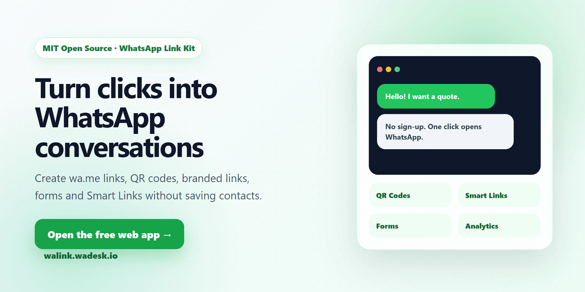
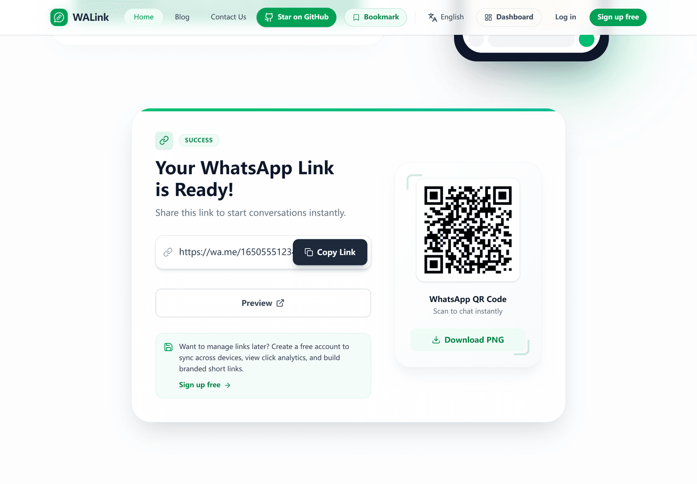
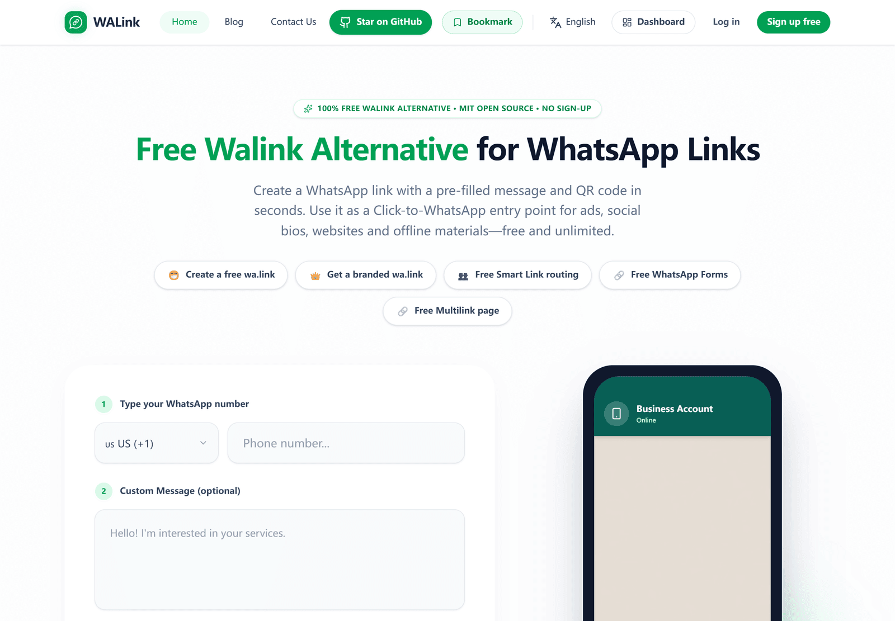
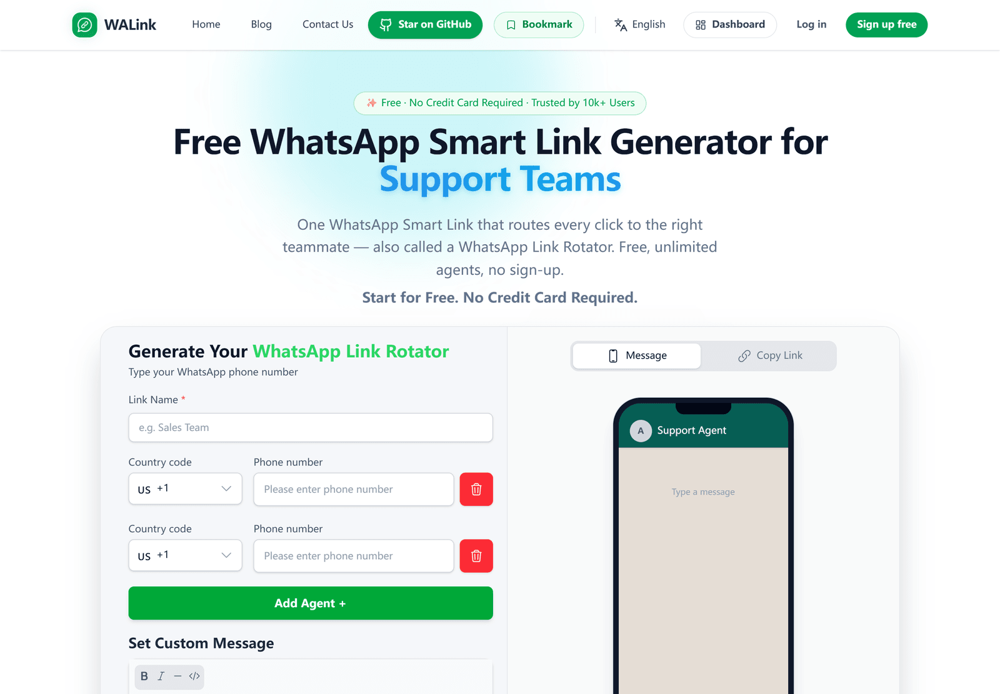

# WALink Kit

[](./LICENSE)

<a href="https://walink.wadesk.io">
  
</a>

<p align="center">
  <a href="https://walink.wadesk.io">
    
  </a>
  <a href="https://walink.wadesk.io/zh-cn">
    
  </a>
  <a href="https://link.wadesk.io">
    
  </a>
</p>

Open-source building blocks for WhatsApp **click-to-chat links**: a zero-dependency
core library, a web generator, a drop-in chat button, and a minimal short-link
backend demo.

🌐 **Official website**: [walink.wadesk.io](https://walink.wadesk.io)
**中文官网**: [walink.wadesk.io/zh-cn](https://walink.wadesk.io/zh-cn)
**Backend demo guide**: [examples/fastapi-demo/README.md](./examples/fastapi-demo/README.md)

---

## What is included

| Package / example | Description |
| ----------------- | ----------- |
| [`@walink/core`](./packages/core) | Zero-dependency TypeScript library: phone normalization, validation and `wa.me` / `api.whatsapp.com` link building |
| [`examples/web`](./examples/web) | Vite + Vue single-page generator with copy link and QR code download |
| [`examples/html-widget`](./examples/html-widget) | Dependency-free floating WhatsApp chat button for any website |
| [`examples/fastapi-demo`](./examples/fastapi-demo) | FastAPI + SQLite short links, redirects and per-day click stats with Docker |

## Screenshots

<a href="https://walink.wadesk.io">
  
</a>

<p align="center">
  
  
  
  
</p>

## Quick start

### Core library

```ts
import { createWhatsAppLink } from "@walink/core";

createWhatsAppLink({
  phone: "13800138000",
  countryCode: "+86",
  message: "Hello",
});
// => "https://wa.me/8613800138000?text=Hello"
```

### Web generator

```bash
pnpm install
pnpm --filter @walink/example-web dev
```

### Backend demo

```bash
cd examples/fastapi-demo
docker compose up
# API docs at http://localhost:8000/docs
```

## Try WALink Cloud

Use the hosted app when you want a zero-maintenance product instead of running the
demo yourself:

- 👉 **English / 中文**: [walink.wadesk.io](https://walink.wadesk.io)
- 🇪🇸 **Español / Português**: [link.wadesk.io](https://link.wadesk.io)
- Unlimited WhatsApp links, QR codes, branded links, forms and Smart Link examples
- No contact saving required before starting a chat

## Self-hosted vs WALink Cloud

| Capability | This open-source kit | WALink Cloud |
| ---------- | -------------------- | ------------ |
| Build WhatsApp links | ✅ | ✅ |
| QR codes | ✅ (example) | ✅ |
| Chat button | ✅ | ✅ |
| Short links + basic click counts | ✅ (demo) | ✅ |
| Link rotator / smart rules | ❌ | ✅ |
| Visitor analytics & dashboards | ❌ | ✅ |
| Authentication & team management | ❌ | ✅ |
| Abuse protection & rate limiting | ❌ | ✅ |
| Hosting, uptime & maintenance | Self-managed | ✅ Managed |

Need advanced routing, analytics and zero-maintenance hosting? Try the
**[WALink online generator · English / 中文](https://walink.wadesk.io)** or the
**[Generador en línea · Español / Português](https://link.wadesk.io)**.

## Development

```bash
pnpm install
pnpm lint
pnpm test          # core library unit tests
pnpm build         # build the core library
```

The backend demo has its own test suite:

```bash
cd examples/fastapi-demo
pytest
```

## License

Released under the [MIT License](./LICENSE). The **WALink** name, logos and
official domains are trademarks and are not covered by the MIT license; see
[TRADEMARK.md](./TRADEMARK.md).
